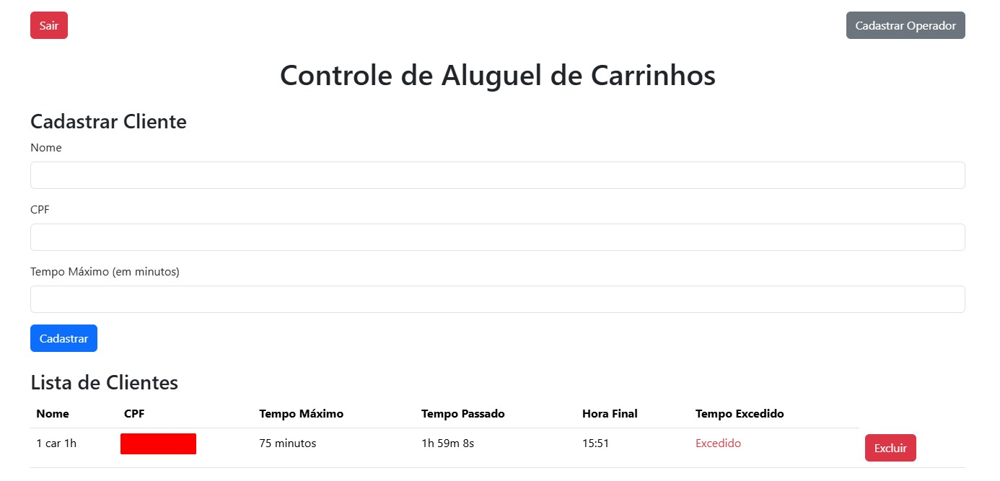

# Carts Rental Management

Sistema web para controle de aluguel de carrinhos em eventos. A aplicacao permite cadastrar operadores, registrar clientes, acompanhar tempo de uso em tempo real e identificar alugueis que passaram do limite configurado.

## Funcionalidades

- Login com Firebase Authentication.
- Cadastro de operadores.
- Cadastro de clientes com nome, CPF e tempo maximo de uso.
- Listagem em tempo real dos clientes em atendimento.
- Calculo de tempo passado desde o inicio do aluguel.
- Previsao de horario final.
- Indicacao visual de tempo excedido.
- Exclusao de registros finalizados.

## Tecnologias

- React 18
- React Router DOM
- Firebase Authentication
- Cloud Firestore
- React Firebase Hooks
- Bootstrap
- Styled Components

## Requisitos

- Node.js 18 ou superior
- NPM
- Projeto Firebase com Authentication e Firestore habilitados

## Configuracao

Configure o Firebase em `src/firebaseConfig.js` com os dados do seu projeto. No console do Firebase, habilite:

- Authentication por email/senha.
- Cloud Firestore.
- Regras de acesso adequadas ao ambiente de uso.

## Rodando localmente

```bash
git clone https://github.com/gb-araujo/carts-rental-management.git
cd carts-rental-management
npm install
npm start
```

A aplicacao roda em `http://localhost:3000`.

## Estrutura principal

```text
src/
  App.js                         # Rotas protegidas por autenticacao
  firebaseConfig.js              # Configuracao Firebase
  components/
    Login.js                     # Login do operador
    ControleAluguel.js           # Fluxo principal de aluguel
    OperadorForm.js              # Cadastro de operador
```

## Scripts

| Comando | Descricao |
| --- | --- |
| `npm start` | Inicia o ambiente de desenvolvimento |
| `npm test` | Executa testes do Create React App |
| `npm run build` | Gera build de producao |

## Imagem da plataforma



## Melhorias futuras

- Criar niveis de permissao para operadores e administradores.
- Adicionar relatorios por evento/data.
- Implementar filtros e busca na lista de clientes.
- Adicionar testes para calculo de tempo e rotas protegidas.
